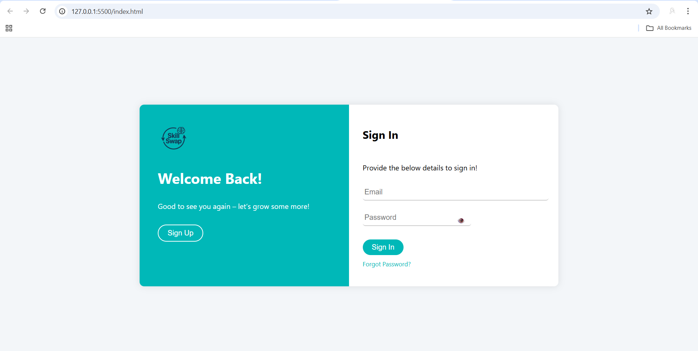

# 💡 Skill Swap — A Peer-to-Peer Learning Exchange Platform

## 🚀 Overview
**Skill Swap** is a full-stack web application designed to connect individuals who want to learn and teach different skills. Users can swap knowledge instead of money, making it an innovative platform for mutual growth and collaboration.

## 🎯 Features
- 🔐 **User Authentication** – Sign up and log in with secure credentials.
- 🧠 **Add Skills** – Users can list what they can teach and what they want to learn.
- 🤝 **Skill Matching** – Smart matching system to suggest ideal swap partners.
- 📤 **Swap Requests** – Send and receive requests with real-time status updates.
- 📁 **Certificate Upload** – Upload proof of skill using MultipartFile.
- 🔗 **LinkedIn & GitHub Integration** – Showcase external profiles for trust-building.
- 💬 **Chat Feature** – Initiate communication after accepting a swap request.
- 🔔 **Notifications** – Get alerts for requests, matches, and more!

## 🛠️ Tech Stack

| Layer       | Tech Used                                                 |
|-------------|-----------------------------------------------------------|
| Frontend    | HTML, CSS, JavaScript                                     |
| Backend     | Java, Spring Boot                                         |
| Database    | MySQL                                                     |
| File Upload | MultipartFile (Spring Boot)                               |
| Tools Used  |Vscode, Eclipse, MySQL, Postman, Git and Github            |

## 🗂️ Modules Overview
- `User` – Handles registration, login, and user profile
- `Skill` – Manage user skills and skill categories
- `SwapRequest` – Core feature: match users and send swap requests
- `Notification` – Alert users on swap actions via email
- `Chat` – Message center for approved swap requests

## 📸 Screenshots *(Optional: Add screenshots here)*  
### 🔐 Login Page

## 🧠 What I Learned
- Structuring and managing a **modular Spring Boot** application
- Implementing **REST APIs** and using them from frontend
- Handling **file uploads and linking external profiles**
- Building real-time logic for **notifications and chat**
- Understanding the **MVC architecture** and backend-to-frontend integration

## 📈 Future Enhancements
- 📲 Real-Time Chat using WebSockets
- 🌟 Ratings and Reviews after skill swaps
- 🎨 Improved UI with Tailwind or Bootstrap
- 📆 Skill session scheduling

## 📌 How to Run
1. Clone the repository  
2. Create a MySQL database and update `application.properties`  
3. Run the project using your IDE or `mvn spring-boot:run`  
4. Access the app from `http://localhost:8080`

---

## 🤝 Let’s Connect
Built with ❤️ by **P. Sangeetha**  
🔗 [LinkedIn](#) | 🔗 [GitHub](#) *(Add your profile links here)*

